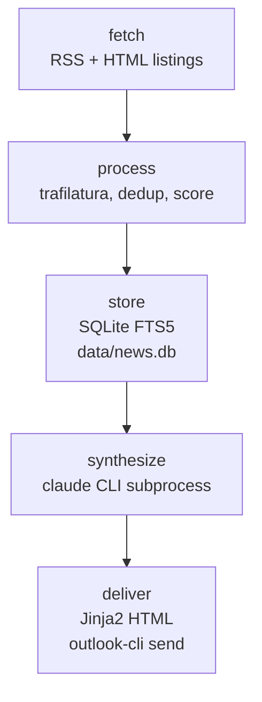

# news

[](https://github.com/weirdapps/news/actions/workflows/ci.yml)
[](LICENSE)
[](https://www.python.org/downloads/)

A forkable Python scaffold that fetches RSS feeds, runs LLM synthesis via the local `claude` CLI, and emails curated digests on a schedule. Five profiles ship in the box, all sharing one five-stage pipeline and one SQLite store.

The `claude` CLI subprocess is the only LLM surface. There is no `anthropic` SDK dependency, no `api.anthropic.com` call, and no per-project API key: LLM calls inherit whatever routing the local `claude` binary is configured for (in the maintainer's setup, Vertex AI).

## Profiles

| Profile | Cadence | Scope | Delivery |
|---------|---------|-------|----------|
| `digest` | 5x daily (00, 09, 13, 17, 21 Athens) | Broad multi-topic news from `config/sources.yaml` (48 feeds shipped) | Email |
| `monitor` | Bi-hourly 08 to 22 Athens + 00 catch-up | Brand mentions + competitor watch, driven by your `config/monitor/keywords.yaml` | Email, skipped when no new mentions |
| `stack` | Once daily, 13:00 Athens | AI / dev intelligence from `config/stack/sources.yaml` (45 feeds shipped) | Email |
| `market` | ~25 min before each daytime slot (03:35, 07:35, 11:35, 15:35, 19:35 Athens) | Market-moving news for equities and macro (`config/market/sources.yaml`, 19 feeds) | Store-only by default (persisted for an upstream Investment Brief), email if `NEWS_MARKET_RECIPIENT` is set |
| `topic` | Ad-hoc via `--query` | Single subject pulled from a Google News RSS query | Email or stdout via `--print` |

All profiles hit the same pipeline. The `--profile` flag selects the config dir, synthesis prompt, and email template at runtime. Profile names are enforced by `VALID_PROFILES` in `news/config.py`.

## Pipeline



Each stage is one module under `news/`:

| Stage | Module | Responsibility |
|-------|--------|----------------|
| fetch | `news/fetcher.py` | Concurrent RSS pull, feed-less HTML listing scrape |
| process | `news/processor.py`, `news/tagger.py` | Full text extraction, deduplication, category + ticker tagging, relevance scoring |
| store | `news/storage.py` | SQLite (FTS5) at `data/news.db`, migrations, dedup by content hash |
| synthesize | `news/synthesizer.py`, `news/monitor_synth.py`, `news/stack_synth.py`, `news/market_synth.py`, `news/topic_synth.py` | Profile-specific prompt, `claude` CLI subprocess, JSON parse, `news/citation_filter.py` drops any bullet whose source is not in the article pool |
| deliver | `news/deliver.py` | Jinja2 render into `templates/*.html`, send via `outlook-cli` |

Supporting modules: `news/auth.py` (gcloud auth probe before spending on a synthesis call), `news/config.py` (profile-aware YAML loader with `${VAR:-default}` expansion), `news/models.py` (`Article`, `Digest`, `Source` dataclasses), `news/query.py` (search / stats / ticker lookups), `news/mcp_server.py` (optional MCP server).

## How the LLM is called

`news/synthesizer.py:invoke_claude()` shells out to the `claude` CLI. Every profile's `settings.yaml` sets:

```yaml
synthesis:
  claude_command: ${NEWS_CLAUDE_COMMAND:-claude}
  claude_args:
    - "--print"
    - "--model"
    - "opus"      # or "sonnet" for the topic profile
  timeout: 300
  max_retries: 2
```

At call time the module appends `--bare --output-format json`, resolves the tier alias (`opus` / `sonnet`) to the provisioned Vertex model id and region (defaults live in `~/.config/nbg-vertex/env` if present), and runs the subprocess with the prompt on stdin. If `claude` returns a refusal, a non-zero envelope, or times out, the retry / fallback path in `synthesizer.py` degrades to a plain-text summary and the email is sent as a one-line alert instead of an unsynthesized dump.

If your `claude` CLI is on `$PATH` and authenticated, no further configuration is needed. Point `NEWS_CLAUDE_COMMAND` at an absolute path if it is not.

## Quickstart

```bash
# 1. Clone
git clone https://github.com/weirdapps/news.git
cd news

# 2. Install (uv is the primary tool; pip works too)
uv sync                       # creates .venv, installs runtime + dev deps from uv.lock
# OR
python -m venv .venv && source .venv/bin/activate
pip install -e ".[dev]"

# 3. Configure recipients
cp .env.example .env
$EDITOR .env                  # set NEWS_RECIPIENT, plus any profile-specific recipients

# 4. (monitor only) Fork your brand identity + feeds
cp config/monitor/keywords.example.yaml config/monitor/keywords.yaml
cp config/monitor/sources.example.yaml   config/monitor/sources.yaml
$EDITOR config/monitor/keywords.yaml config/monitor/sources.yaml

# 5. Smoke-test each profile
python3 main.py --adhoc                                          # digest
python3 main.py --profile monitor --adhoc                        # monitor
python3 main.py --profile stack   --adhoc                        # stack
python3 main.py --profile market  --adhoc                        # market (store-only unless recipient set)
python3 main.py --profile topic   --query 'ECB rates' --print    # topic brief to stdout

# 6. (macOS, optional) Schedule via launchd
cp launchd/com.news.digest.example.plist  ~/Library/LaunchAgents/com.news.digest.plist
cp launchd/com.news.monitor.example.plist ~/Library/LaunchAgents/com.news.monitor.plist
$EDITOR ~/Library/LaunchAgents/com.news.digest.plist    # replace /PATH/TO/... placeholders
launchctl load ~/Library/LaunchAgents/com.news.digest.plist
launchctl load ~/Library/LaunchAgents/com.news.monitor.plist
```

`--scheduled` is the default when neither `--scheduled` nor `--adhoc` is passed. Ad-hoc runs force a full pass regardless of schedule (useful for smoke tests). Each profile takes a separate lock file (`data/pipeline-<profile>.lock`), so profiles can run concurrently without stepping on each other.

### Ad-hoc topic briefs

```bash
python3 main.py --profile topic --query 'M&A activity in European banking' --hours 48
python3 main.py --profile topic --query '"Claude Code"' --hours 72 --print
```

| Flag | Default | Notes |
|------|---------|-------|
| `--query "string"` | required | Plain text passed to a Google News RSS query. Wrap multi-word brand names in `"..."` for an exact-phrase match. |
| `--hours N` | `24` | Lookback window, clamped to 1 to 168 (1 week max). |
| `--print` | off | Render to stdout instead of emailing. Useful for terminal previews. |

Topic runs persist to `data/news.db` with `pipeline='topic'`, so the MCP server's `search_news` tool finds them later. There is no scheduled cadence: topic briefs only fire when you ask.

## Configuration reference

### Environment variables (`.env`)

The loader (`news/config.py`) reads `.env` at import time (real environment variables win over `.env`) and expands `${VAR}` / `${VAR:-default}` inside every YAML config.

| Variable | Used by | Default | Purpose |
|----------|---------|---------|---------|
| `NEWS_RECIPIENT` | digest | `user@example.com` | Digest email recipient |
| `NEWS_MONITOR_RECIPIENT` | monitor | `user@example.com` | Monitor email recipient |
| `NEWS_STACK_RECIPIENT` | stack | `user@example.com` | Stack email recipient |
| `NEWS_MARKET_RECIPIENT` | market | `user@example.com` | Market email recipient (market is store-only until this is set) |
| `NEWS_TOPIC_RECIPIENT` | topic | `user@example.com` | Topic email recipient (ignored with `--print`) |
| `NEWS_CLAUDE_COMMAND` | all | `claude` | Override the `claude` CLI binary (absolute path when not on `$PATH`) |
| `NEWS_VENV_PYTHON` | `run_mcp.sh` only | (unset) | Explicit venv python for the MCP launcher |

### YAML layout

```text
config/
  settings.yaml            # digest pipeline settings, scoring, schedule
  sources.yaml             # digest RSS feeds (48 shipped)
  categories.yaml          # digest topic categories + keyword scoring
  tickers.yaml             # stock-ticker dictionary used by the tagger
config/monitor/
  settings.yaml            # monitor pipeline settings
  sources.example.yaml     # RSS-feed template (committed)
  sources.yaml             # your feeds (gitignored)
  keywords.example.yaml    # brand identity template (committed)
  keywords.yaml            # your brand identity (gitignored)
config/stack/
  settings.yaml, sources.yaml, categories.yaml
config/market/
  settings.yaml, sources.yaml, categories.yaml
config/topic/
  settings.yaml            # topic profile has no shipped sources (built at runtime from --query)
launchd/
  com.news.digest.example.plist    # macOS scheduler templates (committed)
  com.news.monitor.example.plist
  com.news.digest.plist            # your working copies (gitignored)
  com.news.monitor.plist
```

The `*.example.*` files are committed; the real working copies are gitignored, so a fork can be filled in with real brand data and RSS lists without ever exposing them upstream.

### Brand extraction (monitor)

The monitor profile reads its identity from `config/monitor/keywords.yaml` at runtime. Nothing brand-specific is hard-coded. The seams are:

- `news/roster.py` exports `NAME_HANDLING_RULES` (brand-neutral prompt guidance) and `build_roster(keywords_config)` (brand-aware roster).
- `news/monitor_synth.py` composes the synthesis prompt from four section builders (`_base_prompt`, `_disambiguation_section`, `_competitor_section`, `_output_format_section`); each returns `""` on empty input so the prompt is fail-soft.
- `news/processor.py:compute_relevance_score()` reads name patterns from `keywords_config["company"]["names"]` and `keywords_config["competitors"]` rather than any baked-in list.
- `templates/monitor.html` iterates `competitor_watch.items()` and uses `display.monitor_label` / `display.short_name` for labels.

Design rationale: `docs/superpowers/specs/2026-05-04-brand-extraction-design.md`.

## Email delivery

Sending goes through [`outlook-cli`](https://github.com/weirdapps/outlook-cli) (Microsoft Graph). The integration point is one function, `send_email()` in `news/deliver.py`, which shells out to:

```text
outlook-cli send-mail --to <recipient> --subject <s> --html <tempfile> \
                      --send-now --no-cc-self --no-signature
```

Swap that function for anything else that accepts an HTML body (Gmail API, SMTP, SendGrid, etc.). The Jinja2 templates already produce Outlook-Mac-safe HTML (table layout, inline CSS, no `<p>` tags), so most clients render cleanly.

Failure handling: if the send call returns non-zero, `main.py` writes the rendered HTML to a fallback file (`save_fallback()`) and pops a macOS notification via `notify_macos()`.

## MCP server (optional)

`run_mcp.sh` launches the `news-reader` MCP server defined in `news/mcp_server.py`. It exposes four tools over the shared `data/news.db`:

| Tool | Description |
|------|-------------|
| `search_news` | Keyword search across article title + content, filterable by pipeline / category / ticker / days |
| `digest_history` | Recent AI-curated syntheses (executive briefs + sections) for `pipeline='digest'` or `'monitor'` |
| `news_stats` | Article counts, category distribution, source distribution, date range |
| `recent_for_tickers` | Ticker-filtered recent news (portfolio + watchlist workflows) |

Register with Claude Code (or any MCP client):

```json
{
  "mcpServers": {
    "news-reader": {
      "command": "/absolute/path/to/news/run_mcp.sh"
    }
  }
}
```

The launcher auto-detects a venv in this order: `$NEWS_VENV_PYTHON`, `./.venv`, `./venv`, `~/.venvs/news`, then bare `python3`.

## Development

```bash
uv sync                   # install runtime + dev deps (or: pip install -e ".[dev]")
pytest                    # ~210 test functions, all HTTP + claude CLI mocked
ruff check .              # lint (runs in CI)
ruff format --check .     # format check (runs in CI)
pre-commit install        # optional: ruff + mypy + gitleaks on every commit
```

Tests use in-memory SQLite, mock every outbound HTTP call, and mock the `claude` CLI subprocess. No real LLM calls happen during testing.

The `pyproject.toml` `[[tool.mypy.overrides]]` block that excludes `scripts.*` from strict typing is intentional; the utility scripts under `scripts/` are one-offs.

## CI

- `.github/workflows/ci.yml`: lint (`ruff check`, `ruff format --check`) then test (`pytest`) on push and PR to `master`, Python 3.12.
- `.github/workflows/sonarcloud.yml`: SonarCloud scan on push to `main` / `master`, pull requests, and `workflow_dispatch`; the SonarCloud step is skipped automatically when `SONAR_TOKEN` is not configured on a fork.
- `.github/workflows/dependabot-auto-merge.yml`: auto-merges Dependabot minor / patch bumps once CI is green.
- `.github/dependabot.yml`: weekly updates from the `uv` ecosystem (keeps `uv.lock` in sync with `pyproject.toml`) and `github-actions`, grouped into `production-dependencies` and `development-dependencies`.

## Requirements

- Python 3.12+
- `claude` CLI on `$PATH` (or set `NEWS_CLAUDE_COMMAND`)
- `outlook-cli` installed and authenticated, or a drop-in replacement in `send_email()`
- macOS if you want to use the bundled `launchd` plists; any cron-equivalent works elsewhere (the maintainer runs the pipelines as `systemd --user` timers on Linux)
- `uv` (recommended) or `pip` for dependency management

## Tech stack

Python 3.12+, feedparser, httpx, trafilatura, readability-lxml, lxml, Jinja2, PyYAML, MarkupSafe, `mcp[cli]`, SQLite (FTS5), the local `claude` CLI, and `outlook-cli` for delivery. Full pin set in `pyproject.toml` and `uv.lock`.

## License

MIT, see [LICENSE](LICENSE).
